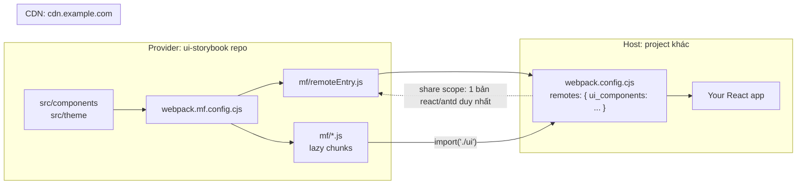

# Integrate `ui-storybook` vào project khác

Repo expose 2 cách. Chọn theo nhu cầu:

| Cách | Khi nào dùng | Host nhận gì |
|---|---|---|
| **A. npm package** | Host build-time, version cố định trong `package.json` | `npm install ui-storybook` |
| **B. Module Federation** | Host load runtime qua URL, deploy độc lập, không cần rebuild host | `remoteEntry.js` qua CDN |

Cách B chính là cái bạn hỏi:

```js
remoteUrl: "https://cdn.example.com/ui-components/0.0.10/mf/remoteEntry.js"
remoteName: "ui_components"
```

---

# B. Module Federation — step by step

## B0. Kiến trúc



`remoteName` = `name` trong `ModuleFederationPlugin` của provider. Host dùng nó để tìm global `window.ui_components` sau khi script load xong. **Sai lệch → `global "ui_components" is undefined`.**

## B1. Provider — build container

Đã cấu hình sẵn trong `webpack.mf.config.cjs`:

```js
const MF_NAME = "ui_components";        // = remoteName phía host
const PUBLIC_PATH = process.env.MF_PUBLIC_PATH || "auto";

new webpack.container.ModuleFederationPlugin({
	name: MF_NAME,
	filename: "remoteEntry.js",
	exposes: {
		"./ui": "./src/mf/entry.tsx",                       // barrel
		"./ThemeProvider": "./src/theme/ThemeProvider.jsx",
		"./themeConfig": "./src/theme/themeConfig.js",
		"./TokenShowcase": "./src/components/TokenShowcase/TokenShowcase.jsx",
	},
	shared: {
		react: { singleton: true, requiredVersion: false },
		"react-dom": { singleton: true, requiredVersion: false },
		"react/jsx-runtime": { singleton: true, requiredVersion: false },
		"react-dom/client": { singleton: true, requiredVersion: false },
		antd: { singleton: true, requiredVersion: false },
	},
});
```

Build:

```bash
bun run build:mf          # → mf/remoteEntry.js + chunks
bun run build:mf:dev      # unminified, đọc được
```

Thêm component mới → sửa **cả 2 chỗ**:

1. `src/index.ts` (npm entry)
2. `src/mf/entry.tsx` (MF barrel)

### `PUBLIC_PATH` — quan trọng nhất

Chunk là lazy, URL resolve từ `output.publicPath`:

| Giá trị | Kết quả |
|---|---|
| `"auto"` (default) | Suy từ `document.currentScript.src` lúc chạy → đổi version CDN không cần rebuild |
| `"/0.0.10/mf/"` | Hard-code absolute path trên domain |
| `https://cdn.example.com/ui-components/0.0.10/mf/` | Full URL, dùng khi host ở domain khác |

Deploy versioned (khuyến nghị):

```bash
MF_PUBLIC_PATH=auto bun run build:mf
```

Giữ `auto` để mỗi version nằm ở prefix riêng vẫn tự resolve đúng.

### `shared` — chống duplicate React/antd

`singleton: true` = chỉ 1 bản trên page. Không có nó: 2 React instance → `Invalid hook call`; 2 antd → `ConfigProvider` context vỡ, theme token bị bỏ qua.

`requiredVersion: false` = không force version khớp. Host React 19.3 + provider 19.2 vẫn chấp nhận.

Nếu host **không** khai báo `shared`, provider vẫn chạy — webpack rơi về bản của provider (**fallback chunk 1.36 MiB chứa antd**). Vẫn đúng, nhưng phí băng thông và có thể lệch theme.

## B2. Deploy lên CDN

`vercel.json` đã cấu hình:

```json
{
	"buildCommand": "npm run build:mf && npm run build-storybook",
	"outputDirectory": "storybook-static",
	"headers": [
		{
			"source": "/mf/remoteEntry.js",
			"headers": [
				{ "key": "Access-Control-Allow-Origin", "value": "*" },
				{ "key": "Cross-Origin-Resource-Policy", "value": "cross-origin" },
				{ "key": "Cache-Control", "value": "no-cache, must-revalidate" }
			]
		},
		{
			"source": "/mf/(.*)",
			"headers": [
				{ "key": "Access-Control-Allow-Origin", "value": "*" },
				{ "key": "Cross-Origin-Resource-Policy", "value": "cross-origin" },
				{ "key": "Cache-Control", "value": "public, max-age=31536000, immutable" }
			]
		}
	]
}
```

`scripts/copy-mf.mjs` copy `mf/` vào `storybook-static/<version>/mf/` + `storybook-static/mf/` (alias latest) + ghi `mf-manifest.json`.

Kết quả:

```
https://cdn.example.com/ui-components/0.0.10/mf/remoteEntry.js   ← pinned version
https://cdn.example.com/ui-components/mf/remoteEntry.js          ← latest
https://cdn.example.com/ui-components/mf-manifest.json           ← discovery
```

### Bắt buộc: CORS

Chunk load cross-origin. Thiếu `Access-Control-Allow-Origin` → browser block:

```
Access to script at 'http://localhost:8080/906.6c1c19c4.js' from origin
'http://localhost:8081' has been blocked by CORS policy
```

Đây là lỗi thực đã gặp khi verify. Header ở trên fix.

**Cache:** `remoteEntry.js` phải `no-cache` (host cần thấy version mới); chunk content-hashed nên `immutable 1 năm` an toàn.

## B3. Host — consume

### Cách 1: Static remote (đơn giản nhất)

`webpack.config.cjs` của host:

```js
new webpack.container.ModuleFederationPlugin({
	name: "my_app",                                  // PHẢI khác "ui_components"
	remotes: {
		ui_components: "ui_components@https://cdn.example.com/ui-components/0.0.10/mf/remoteEntry.js",
	},
	shared: {
		react: { singleton: true, requiredVersion: false },
		"react-dom": { singleton: true, requiredVersion: false },
		"react/jsx-runtime": { singleton: true, requiredVersion: false },
		"react-dom/client": { singleton: true, requiredVersion: false },
		antd: { singleton: true, requiredVersion: false },
	},
});
```

Dùng:

```jsx
const RemoteUI = lazy(() =>
	import("ui_components/ui").then((m) => ({
		default: () => {
			const { ThemeProvider, TokenShowcase } = m;
			return (
				<ThemeProvider>
					<TokenShowcase />
				</ThemeProvider>
			);
		},
	})),
);

<Suspense fallback={<Spinner />}>
	<RemoteUI />
</Suspense>
```

Webpack tự inject `<script>`, tự chờ global, tự `init()`. Không viết loader.

### Async boundary — bắt buộc

Entry host **không được** import React trực tiếp. Phải tách:

```js
// src/index.jsx
import("./bootstrap");

// src/bootstrap.jsx
import { createRoot } from "react-dom/client";
import App from "./App";
createRoot(document.getElementById("root")).render(<App />);
```

Không tách → lỗi đã gặp khi verify:

```
Error: Shared module is not available for eager consumption:
webpack/sharing/consume/default/react/react
```

Lý do: share scope init bất đồng bộ, entry chạy đồng bộ. `import()` tạo ranh giới async cho webpack kịp init.

### Cách 2: Runtime loader (URL từ config/env)

Khi version không biết lúc build. Copy `examples/mf-host/loadRemote.js`:

```js
import { loadRemoteModule } from "./loadRemote";

const ui = await loadRemoteModule("ui-components", "./ui", {
	remoteUrl: process.env.UI_REMOTE_URL,
});
// ui.ThemeProvider, ui.TokenShowcase, ui.VERSION, ui.mount
```

Loader làm 3 việc:

```js
// 1. inject <script>, chờ global
const container = await loadScript(remoteUrl, remoteName);
// 2. init với share scope của host — gọi ĐÚNG 1 LẦN
await __webpack_init_sharing__("default");
await container.init(__webpack_share_scopes__.default);
// 3. lấy module
const factory = await container.get("./ui");
const mod = factory();
```

**Gọi `init()` 2 lần trên cùng container → throw:**

```
Container initialization failed as it has already been initialized
with a different share scope
```

Vì vậy `loadRemote.js` cache container theo `remoteName` — không phải optimization mà là bắt buộc.

Host không dùng webpack (Vite/Rspack)? Cần `@module-federation/enhanced` hoặc `@module-federation/runtime` để có `initSharing`/`loadRemote`. Shim tay `__webpack_init_sharing__` chỉ dùng cho smoke test.

### Cách 3: Mount vào DOM node (không cần React ở root)

Cho host Vue/Angular/vanilla:

```js
const { mount } = await loadRemoteModule("ui-components", "./ui");
const unmount = await mount(document.getElementById("widget"), TokenShowcase, {});
// unmount() khi cleanup
```

`mount` đã wrap sẵn `ThemeProvider`.

---

# A. npm package

```bash
bun run build        # → build/ (ESM + CJS + .d.ts + CSS)
npm publish
```

Host:

```bash
bun add ui-storybook
```

```jsx
import "ui-storybook/styles";
import { ThemeProvider } from "ui-storybook";
import { TokenShowcase } from "ui-storybook";

<ThemeProvider theme={{ token: { colorPrimary: "#22c55e" } }}>
	<TokenShowcase />
</ThemeProvider>
```

---

# Troubleshooting

| Lỗi | Nguyên nhân | Fix |
|---|---|---|
| `global "ui_components" is undefined` | `remoteName` ≠ `name` trong MF plugin provider | Đồng bộ 2 giá trị |
| `Shared module is not available for eager consumption` | Host entry import React đồng bộ | Tách `index.jsx` → `import("./bootstrap")` |
| `blocked by CORS policy` | CDN thiếu `Access-Control-Allow-Origin` | Thêm header (xem `vercel.json`) |
| `Container initialization failed as it has already been initialized` | `init()` gọi 2 lần | Cache container theo `remoteName` |
| `Invalid hook call` | 2 bản React | `singleton: true` cho react, react-dom, jsx-runtime, react-dom/client |
| Theme token bị bỏ qua | 2 bản antd | `singleton: true` cho antd |
| `Module "./X" does not exist in container` | Path không có trong `exposes` | Thêm vào `webpack.mf.config.cjs` |
| Chunk 404 | `publicPath` sai | `MF_PUBLIC_PATH=auto` hoặc set absolute |
| Host + provider cùng `uniqueName` | `package.json` `name` trùng | Set `output.uniqueName` khác nhau |

# Verify

```bash
bun run build:mf
bunx serve -l 8080 --cors mf    # --cors bắt buộc

cd examples/mf-host && bun install && bun start
# http://localhost:8081
```

`examples/mf-host/` là reference host hoàn chỉnh — cả 2 pattern, đã test chạy.
